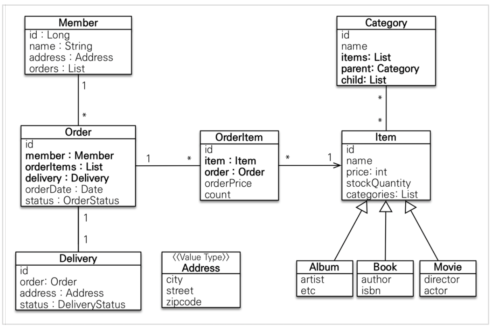

## GraphQL - Prisma - TypeScript 기반 주문 API

- Node.js 환경에서 동작하는 주문 처리 API
- Prisma ORM, GraphQL, TypeScript사용
- 이슈 발생시 GitHub Issue 탭을 활용
- trunk-based branch 전략 사용

## ERD 기획
- 해당 모델 Graphql 로 api 생성
    - 일부 스펙변경, 자기 참조 Category 테이블, Item 종류 테이블 제거

## 완성 ERD

- prisma-erd-generator 사용

- 인증이 필요없는 API
    - Query
        - ~~getAllMembers()~~
        - ~~getAllOrders()~~
        - ~~getAllOrderItems()~~
        - ~~getAllItems()~~
    - Mutation
        - ~~joinMember(input: JoinMemberInput)~~
        - ~~placeOrder(input: PlaceOrderInput)~~
        - ~~registerItem(input: RegisterItemInput)~~
- 인증이 필요한 API(jwt 인증 관리)
    - Query
        - login()
            - jwt 얻어오기
        - getMyOrder()
            - jwt 토큰을 이용한 나의 주문 정보 얻어오기
    - Mutation    
        - registerItemSecurely(input: RegisterItemInput)
            - jwt 토큰을 이용해 인증 후 등록하기

# Todo

1. ~~schema.prirma 엔티티 생성, prisma client 생성~~
2. ~~graphql schema 생성~~
3. ~~resolvers 개발~~
    - ~~연관 필드 얻어오기~~
    - ~~N+1 문제 해결(DataLoader)~~
4. ~~서비스 레이어로 분리~~
    - ~~폴더 구조 js스럽게 변경하기~~
5. ~~테스트 생성~~
    - ~~seed.ts 생성~~
    - ~~unit test는 mock 사용하여 구현~~
    - integration test는 test db(docker container) 사용하여 구현
        - 생략, integration test는 dev 환경의 playground로 대체 가능
6. ~~input 값을 validation 하는 validator 클래스 구현~~
    - ~~joinMember~~
7. order transaction, lock 을 이용한 critical section 설정
    - 비관적 락 사용
8. jwt를 사용하는 인증 관련 API 추가
    - 빠른 개발을 위해 복잡한 로직 제거(refresh, blacklist, db 저장 제거)
    - access token 발급(1h), 인증 구현